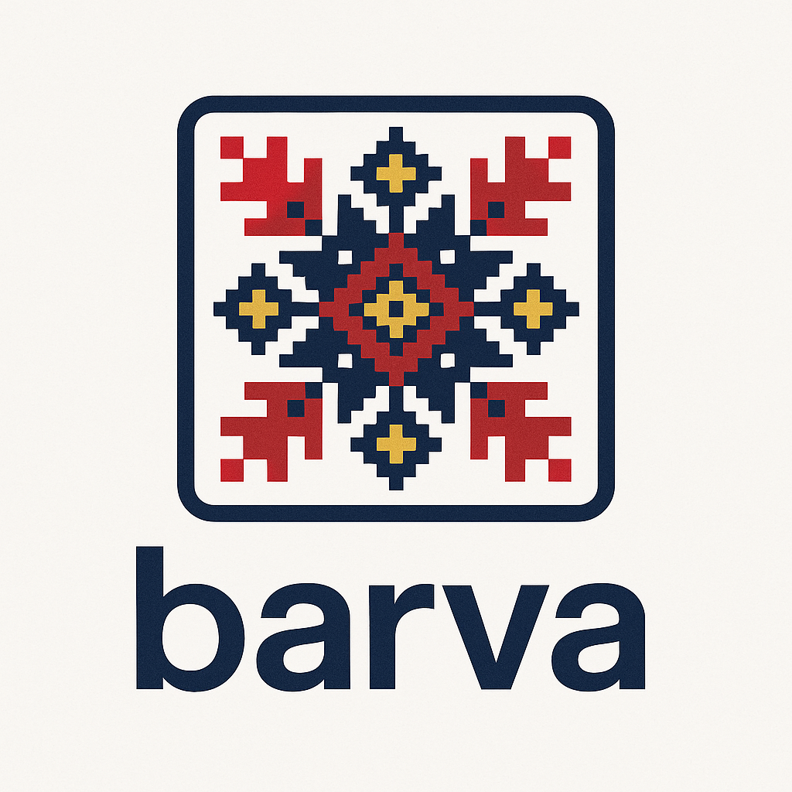

# Barva Theme

**Barva Theme** is a vibrant and professional Visual Studio Code theme inspired by Ukrainian vyshyvanka embroidery. It offers both light and dark variants, designed for comfortable coding during day and night. The theme features a balanced color palette with Ukrainian cultural motifs, ensuring readability and aesthetic harmony.

## ✨ Features

- **Dual Themes**: Choose between **Barva Light** (bright and airy) and **Barva Dark** (deep and calming) to match your workflow.
- **Optimized Syntax Highlighting**: Tailored for JavaScript, TypeScript, HTML, CSS/SCSS, PHP, Python, Java, C/C++, Ruby, JSX/TSX, and more.
- **Semantic Highlighting**: Full support for modern language features, ensuring accurate coloring for variables, functions, and classes.
- **Ukrainian Aesthetic**: Colors inspired by traditional Ukrainian embroidery (#A61C3C red, #2A4B7C blue, #D4A017 yellow, #3A6F3A green).
- **Accessibility**: Colors meet WCAG 2.1 contrast standards for readability and reduced eye strain.
- **Subtle UI Design**: Clean and minimal UI elements for a distraction-free coding environment.

### Barva Light

### Barva Dark

## Icon

## 🎨 Want to see the theme in action?
I’ve prepared a short video overview showing how the theme looks inside a real editor.

▶️ [Watch the review on YouTube](https://youtu.be/Trtltz5r7WY)

## 🛠 Installation

1. Open the **Extensions** sidebar in VS Code (`Ctrl+Shift+X` or `Cmd+Shift+X`).
2. Search for **Barva Theme** and click **Install**.
3. Press `Ctrl+Shift+P` (or `Cmd+Shift+P`), type `Preferences: Color Theme`, and select **Barva Light** or **Barva Dark**.
4. Alternatively, download from the [VS Code Marketplace](https://marketplace.visualstudio.com/items?itemName=ovcharovcoder.barva-theme) or clone this repository and copy to your VS Code extensions folder.

## 📝 Changelog

See the [CHANGELOG.md](https://github.com/ovcharovcoder/barva-theme/blob/main/CHANGELOG.md) for details on updates and improvements.

## Development Date  
- Developed: June 2025

## Author

- Andriy Ovcharov
-  E-mail: ovcharovcoder@gmail.com

## License

Released under the [MIT License](https://raw.githubusercontent.com/ovcharovcoder/barva-theme/main/LICENSE)

Crafted with 💙💛 for Ukrainian culture.
